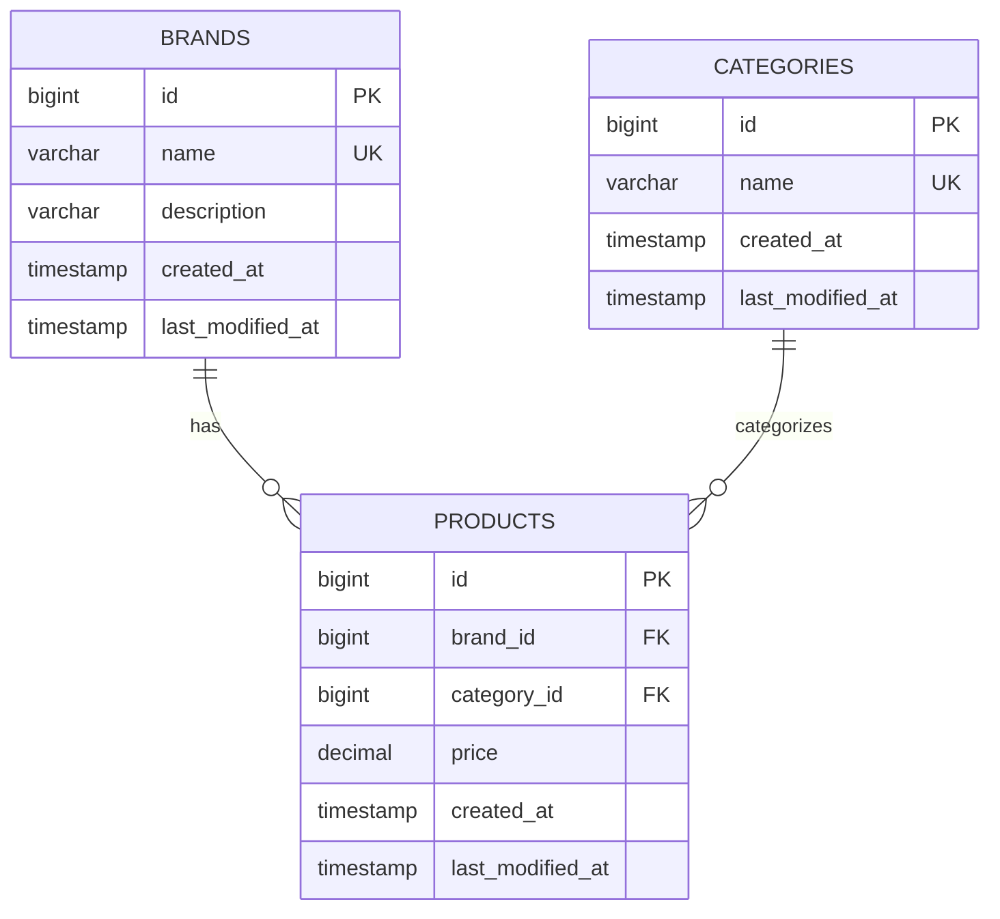

# 무신사 과제 프로젝트
## ERD (Entity Relationship Diagram)



## 구현 범위
### 백엔드 API
- **카테고리별 최저가 조회** (`GET /api/products/lowest-by-category`)
  - 각 카테고리별로 최저가 브랜드와 상품 가격 정보 제공
  - 전체 카테고리 최저가 합계 계산

- **브랜드별 최저가 조회** (`GET /api/products/lowest-brand-total`) 
  - 단일 브랜드로 모든 카테고리 상품을 구매할 때 최저가 브랜드 정보 제공
  - 해당 브랜드의 카테고리별 상품 가격과 총합 제공

- **카테고리 가격대 조회** (`GET /api/products/category/price-range`)
  - 특정 카테고리에서 최저가와 최고가 브랜드 정보 제공
  - Query Parameter로 카테고리명 전달

- **브랜드 관리** (`POST /api/brands`, `PUT /api/brands/{id}`, `DELETE /api/brands/{id}`)
  - 브랜드 생성, 수정, 삭제 기능

- **상품 관리** (`POST /api/products/brand/{brandId}`)
  - 브랜드별 상품 가격 일괄 등록/수정 기능

### 프론트엔드
- **React 기반 SPA**
  - 카테고리별 최저가 상품 조회 화면
  - 브랜드별 최저가 상품 조회 화면  
  - 카테고리 가격대 조회 화면
  - 브랜드 및 상품 관리 화면

### 주요 기술 스택
- **Backend**: Spring Boot 3.4.6, Java 21, JPA/Hibernate, QueryDSL, H2 Database
- **Frontend**: React 18, Axios, React Router
- **Build**: Gradle, Yarn
- **Testing**: JUnit 5, Spring Boot Test

## 코드 빌드, 테스트, 실행 방법

### 개발 환경
- Java 21
- Node.js 16+ 
- Yarn

### 빌드 및 테스트

```bash
# 전체 빌드 (백엔드 + 프론트엔드)
./gradlew build

# 전체 테스트
./gradlew test

# 백엔드 + 프론트엔드 실행
./gradlew bootRun
```
- 백엔드 서버: http://localhost:8080
- 프론트엔드: http://localhost:8080
- H2 Console: http://localhost:8080/h2-console

### 데이터베이스 접속 정보 (H2)
- **URL**: `jdbc:h2:mem:musinsa`
- **Username**: `sa`
- **Password**: (공백)
- **Console**: http://localhost:8080/h2-console

### 성능 최적화
- JPA 지연 로딩 활용
- 인덱스 최적화된 쿼리 설계
- QueryDSL을 통한 N+1 문제 해결
- 스프링 캐시 추상화 활용